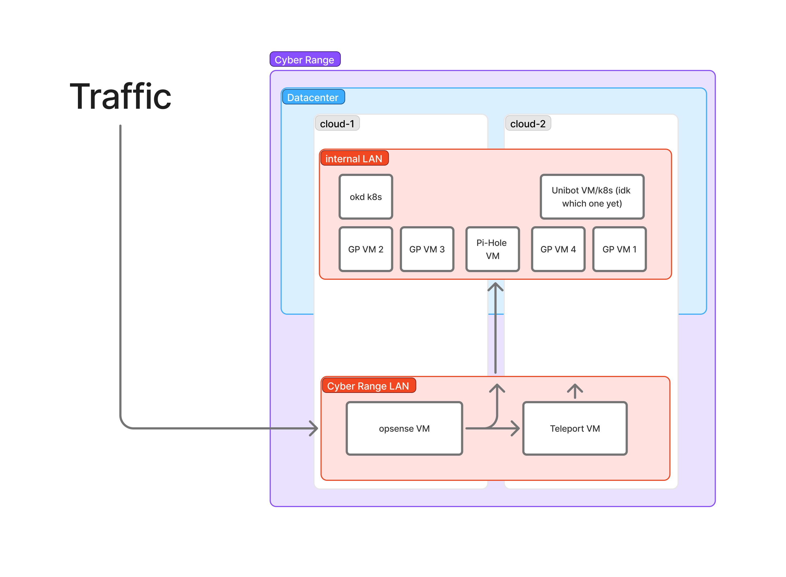

# on-prem-project

This repository contains documentation and files related to the UML Cloud Computing Club's on prem infrastructure.

## Hardware

TODO: Fill in information about our hardware

## Software

Hypervisor: Proxmox

Internal Router: Opnsense

## Networking

### Opnsense and Teleport

#### LAN

IPv4

- Static IP Range: `10.0.0.0 - 10.0.1.255`
- DHCP Range: `10.0.2.0 - 10.0.7.255`

Total Range: `10.0.0.1/21`, `10.0.0.0 - 10.0.7.255`

#### Reserved Static IPs

- opnsense(gateway): `10.0.0.1`
- pihole(dns): `10.0.0.2`
- teleport: `10.0.0.3`
- okd-services: `10.0.0.30`

#### Local DNS Records

`pihole.umlcloudcomputing.org` -> `10.0.0.2`

#### Networking Diagram

